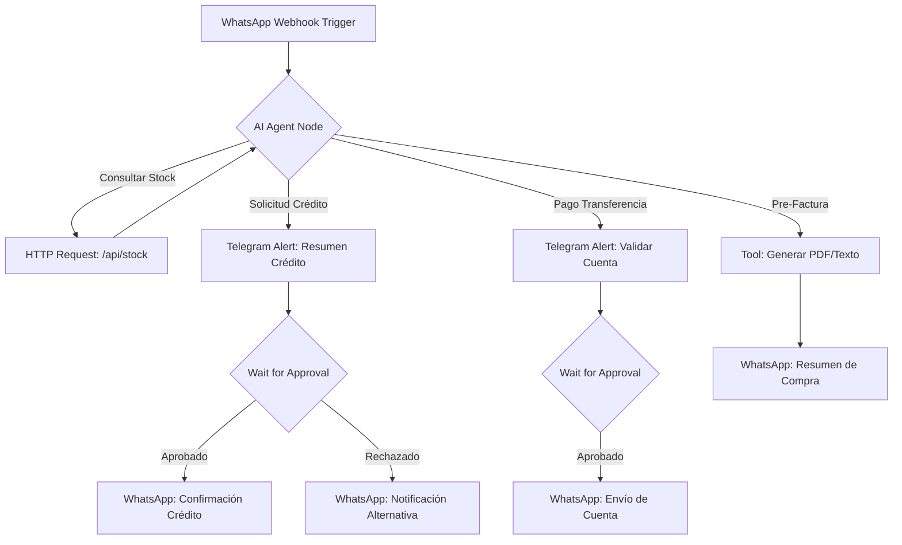

# Deliverable 2: n8n Architecture for Ecugaming Import

## 🏗️ Workflow Logic

The following diagram represents the automated sales flow in n8n.

## 🛠️ Node Details

### 1. Trigger: WhatsApp Webhook
- **Function**: Receives messages and sends them to the AI Agent.
- **Payload**: `from`, `message_body`, `timestamp`.

### 2. AI Agent Node
- **Model**: Grok-1 (or GPT-4o).
- **System Prompt**: Reference to `rules.md`.
- **Memory**: Window buffer of 10 messages.

### 3. Custom Tools (Functions)
| Tool Name | Action | Description |
|-----------|--------|-------------|
| `consultar_stock_web` | HTTP GET | Fetches real-time JSON from `https://your-domain.com/api/stock`. |
| `generar_pre_factura` | Code Node | Formats the line items, taxes, and total into a clean WhatsApp message. |
| `solicitar_aprobacion` | Telegram Node | Sends an interactive message to Raúl with [Aprobar] / [Rechazar] buttons. |

### 4. Human-in-the-Loop Mechanism
- **Nodes**: `Wait for Event` + `Telegram Webhook`.
- **Logic**: When the AI needs approval, it pauses the execution for that specific `chatId`. Once Raúl clicks "Aprobar" in Telegram, the workflow continues and the AI sends the sensitive data to the client.
